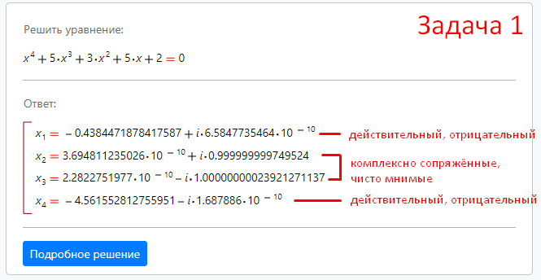
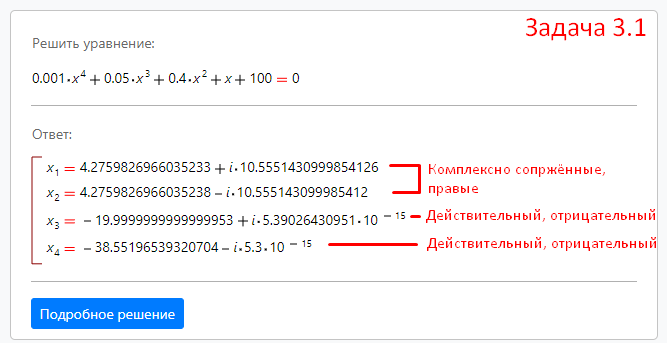
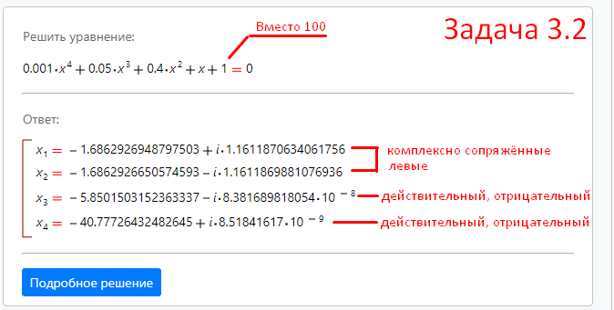

# Определение устойчивости, необходимое и достаточное условие устойчивости
## Вопросы

1. От чего зависит устойчивость системы?
    ```
    б) от структуры и параметров самой системы
    ```
2. В решении дифференциального уравнения, описывающего динамику
системы 2 составляющих: свободная и вынужденная. Какая из них
определяет устойчивость системы?
    ```
    Свободная
    ```
3.  Каким будет уравнение движения системы, если имеется хотя бы
один комплексный корень с положительной вещественной частью?
    ```
    в) расходящиеся гармонические колебания
    ```
4. Каким будет уравнение движения системы, если имеется хотя бы
один мнимый корень?
    ```
    а) незатухающие колебания вокруг нового установившегося значения
    ```
5. В каком случае система находится на колебательной границе
устойчивости, а в каком – на апериодической?
    ```
    Апериодической - если один из корней равен 0 и остальные левые

    Колебательной - если равны 0 вещественные части одной или нескольких пар комплексно сопряжённых корней 
    ```
6.  Что означают понятия: «правые и левые корни»?
    ```
    С положительной и отрицательной вещественной частью соответственно
    ```
7. В чём заключается необходимое, но недостаточное условие
устойчивости?
    ```
    Положительность всех коэффицентов характеристического уравнения
    ```

## Задача 1


Вывод: Система находится на границе колебательной устойчивости, чисто мнимые комплексно сопряжённые корни
## Задача 2


Вывод: Система не устойчива, правые комплексно сопряжённые
## Задача 3.1


Вывод: Система не устойчива, комплексно сопряжённые корни правые
## Задача 3.2


Вывод: Система устойчива, все корни левые